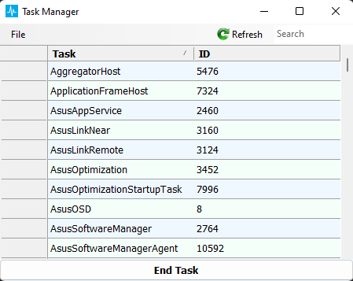
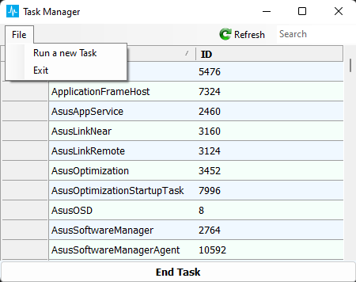
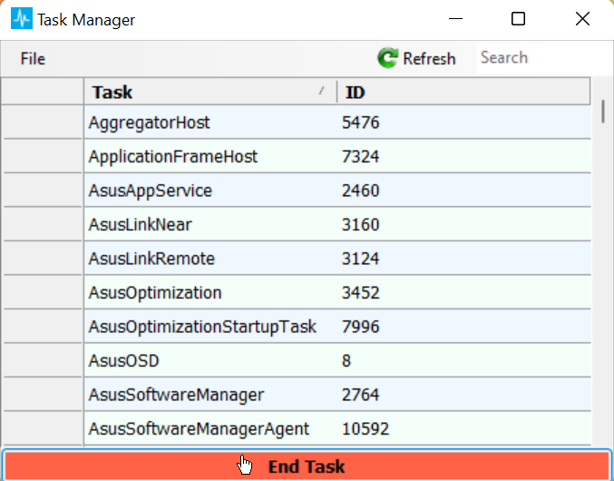

# ProcessManagmentApp
## Table of contents
* [General info](#general-info)
* [Technologies](#technologies)
* [Supported Methods](#supported-methods)
* [The App](#the-app)

### General info
This project implements a task-manager.
	
### Technologies
Project is created with:
* Visual Studio 2022's winforms in c#.

### Supported Methods
1. Get a running process.
2. Terminate a running process.
3. Run a new process.
4. Search a running process.
5. Refresh.
6. Exit.

### The App

